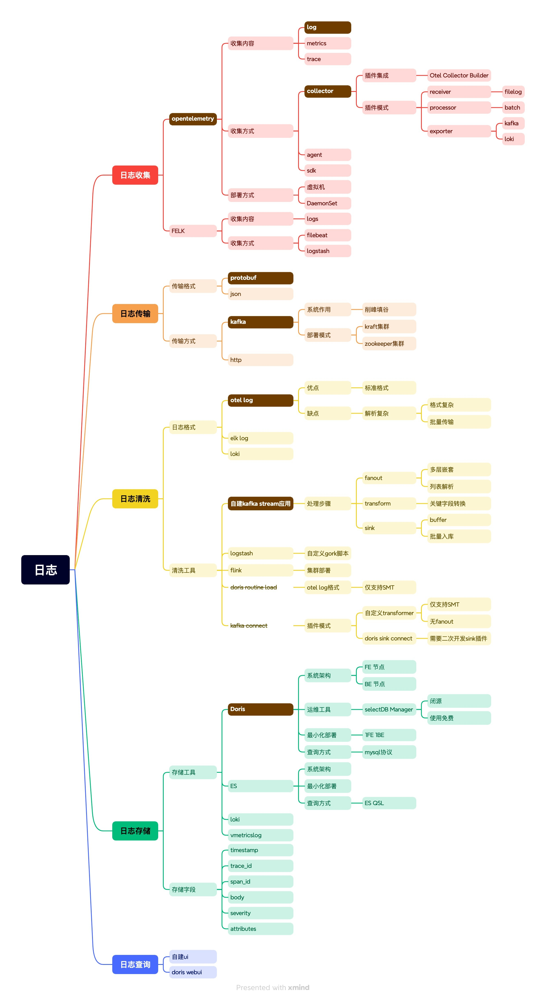

# 云原生日志采集与分析平台

基于 OpenTelemetry、Kafka 和 Apache Doris 构建的云原生日志采集、处理与分析系统。

## 系统架构



## 组件说明

### 数据采集层
- **OpenTelemetry Collector**：使用 OTEL-Proto 模式采集应用日志
- 支持从文件、容器和应用程序直接采集日志数据
- 采集的日志以 OTLP 协议格式通过 Kafka 传输

### 数据处理层
- **Kafka**：消息队列，用于缓存和传输日志数据
- **Kafka Streams**：处理 OTLP 日志数据，转换为适合 Doris 存储的格式
- 实现 Exactly Once 语义保证数据可靠性

### 数据存储与分析层
- **Apache Doris**：分布式 MPP 分析型数据库，用于存储和查询日志数据
- 通过 SelectDB Manager 进行部署和运维
- 支持高性能检索和复杂分析查询

### 数据可视化层
- **Grafana**：基于 Doris 数据源的日志可视化和查询界面
- 支持自定义日志查询和分析仪表板

## 核心功能

1. **完整的日志采集流程**：从应用到存储的端到端解决方案
2. **高性能**：批量处理和写入优化，支持大规模日志数据
3. **可靠性**：通过 Kafka 实现消息可靠传输，支持断点续传
4. **可扩展**：各组件均支持水平扩展，适应业务增长
5. **云原生**：设计符合云原生理念，易于在 Kubernetes 环境部署

## 技术栈

- **OpenTelemetry Collector**: v0.91.0
- **Apache Kafka**: 3.9.0
- **Kafka Streams**: 3.9.0
- **Spring Boot**: 3.4.4
- **Apache Doris**: 2.1.8.3 (基于 SelectDB)
- **Grafana**: 10.3.3

## 部署指南

### 部署 Kafka

```bash
cd kafka
docker-compose up -d
```

### 部署 Doris
```bash
使用selectDB Manager部署
```

初始化 Doris 表结构：

```bash
mysql -h localhost -P 9030 -u root -p < doris_table.sql
```

### 部署 OTEL Collector

```bash
cd otel-collector
./collector-start.sh
```

### 部署 Kafka Streams 服务

```bash
cd otel-kafka-streams
mvn clean package
java -jar target/otel-kafka-streams-1.0.0.jar
```

### 部署 Grafana

```bash
cd grafana
docker-compose up -d
```

## 配置说明

### OTEL Collector 配置

使用 `otel-collector/log-proto.yaml` 配置文件，主要包括：
- 文件日志接收器配置
- 日志解析与转换处理器
- Kafka 导出器配置

### Kafka Streams 配置

修改 `otel-kafka-streams/src/main/resources/application.yml`：
- Kafka 连接参数
- Doris 数据库连接参数
- 批处理大小和时间间隔

## 开发指南

### 环境要求

- JDK 17+
- Maven 3.8+
- Docker & Docker Compose
- Kubernetes 环境 (可选)

### 代码目录结构

- `otel-collector/`: OTEL 收集器配置和启动脚本
- `kafka/`: Kafka 部署配置
- `otel-kafka-streams/`: 日志处理服务
- `doris/`: Doris 数据库配置和表结构
- `grafana/`: Grafana 配置和仪表板

## ROADMAP

### 已完成
- [x] 基础架构搭建
- [x] OTEL Collector 配置与部署
- [x] Kafka 消息队列
- [x] Kafka Streams 处理服务
- [x] Doris 表设计与部署
- [x] 基础日志查询功能 (通过 Doris WebUI)
- [x] OTEL Collector 与 K8s 控制面对接：自动采集 Pod 日志和元数据

### 进行中
- [ ] 查询页面开发：替代 WebUI，提供更友好的查询界面
- [ ] 日志分析性能优化

### 计划中

- [ ] 多集群日志统一管理
- [ ] 分布式追踪与日志关联
- [ ] 多维度日志聚合分析
- [ ] 告警规则配置

## 贡献指南

欢迎提交 Issue 和 Pull Request。请确保提交前：
1. 代码符合项目编码规范
2. 测试通过所有测试用例
3. 提供必要的文档说明


## 参考文档
1. [selectdb manager](https://selectdb.com/download/enterprise)
2. [otlp collector](https://opentelemetry.io/docs/collector)